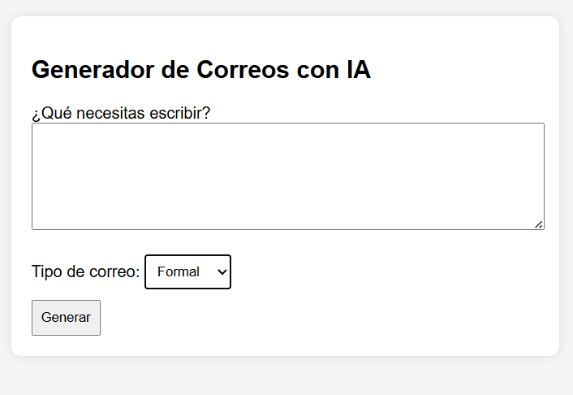
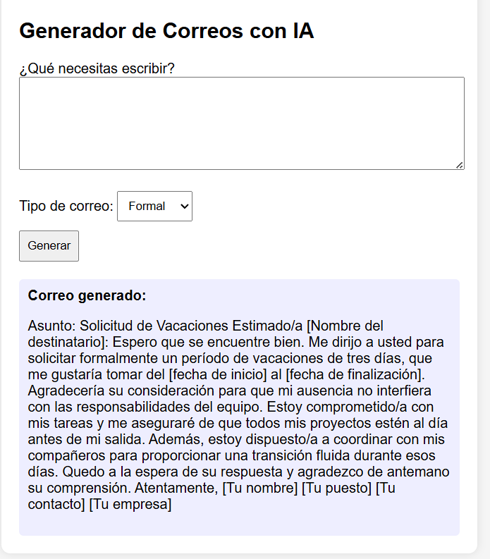

# Generador de Correos con IA (Django)

Aplicación web desarrollada con Django que automatiza la generación de correos profesionales utilizando Inteligencia Artificial.
Permite transformar una solicitud en texto estructurado y listo para enviarse.

---

## Vista del sistema

---

## Descripción

El sistema recibe una solicitud del usuario y genera automáticamente un correo completo utilizando un modelo de lenguaje.

El flujo es:

Usuario → backend Django → API de IA → generación de correo → render en interfaz

Incluye selección de tipo de correo (formal, casual, urgente) para ajustar el tono del contenido.

---

## Funcionalidades

* Generación automática de correos profesionales
* Selección de tipo de redacción (formal, casual, urgente)
* Procesamiento de texto mediante IA
* Interfaz web simple para interacción directa
* Respuestas listas para uso inmediato

---

## Tecnologías utilizadas

* Python
* Django
* OpenAI API
* HTML
* CSS

---

## Seguridad

La API key no se encuentra en el código.
Se maneja mediante variables de entorno utilizando un archivo `.env`, excluido del repositorio mediante `.gitignore`.

---

## Aprendizajes

* Automatización de tareas mediante IA
* Integración de APIs externas en aplicaciones web
* Construcción de prompts para generación de texto estructurado
* Desarrollo de soluciones prácticas orientadas a negocio
* Implementación de interfaces para interacción con modelos de lenguaje

---

## Autor

Aiko Flores
